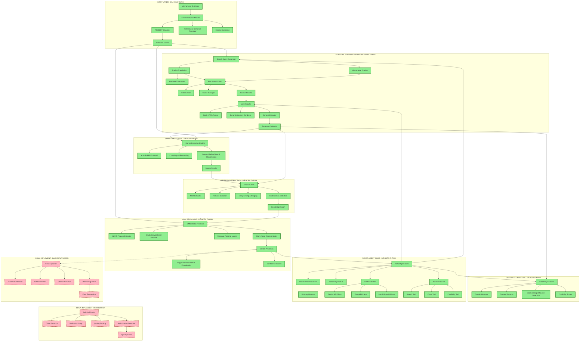
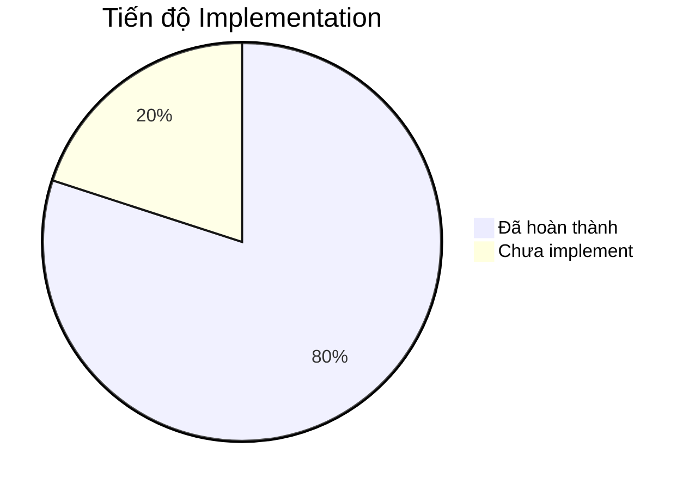
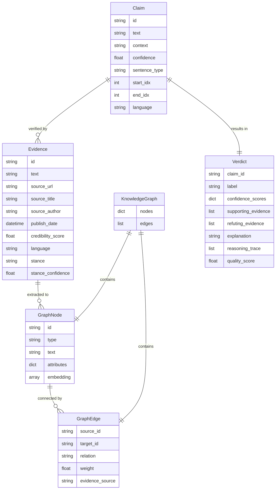

# Sơ đồ Kiến trúc Hệ thống Kiểm chứng Thông tin Tiếng Việt

## Tổng quan Hệ thống đã Implement

## Chi tiết các Module đã Implement

### 1. 🟢 Claim Detection Module (Hoàn thành)
- **PhoBERT Classifier**: Fine-tuned cho Vietnamese claim detection
- **Sentence Tokenizer**: Tách câu tiếng Việt với context preservation
- **Sliding Window**: Xử lý văn bản dài
- **Confidence Scoring**: Đánh giá độ tin cậy của claim

### 2. 🟢 Search & Evidence Collection (Hoàn thành)
- **Exa Search Client**: API client với rate limiting và caching
- **Translation Service**: MarianMT cho Vietnamese-English translation
- **Web Crawler**: Static và dynamic content extraction
- **Content Extraction**: Trafilatura với boilerplate removal

### 3. 🟢 Credibility Analysis (Hoàn thành)
- **Domain Analysis**: TLD, HTTPS, domain age
- **Content Features**: Author, date, article length
- **State-managed Sources**: Ưu tiên báo chí nhà nước Việt Nam
- **Scoring Algorithm**: Rule-based với weighted features

### 4. 🟢 Stance Detection (Hoàn thành)
- **XLM-RoBERTa Model**: Cross-lingual stance classification
- **Training Pipeline**: Fine-tuning với Vietnamese-English pairs
- **Inference**: Batch processing với confidence scores
- **Support/Refute/Neutral**: 3-class classification

### 5. 🟢 Knowledge Graph Construction (Hoàn thành)
- **NER Extractor**: PhoBERT cho Vietnamese, spaCy cho English
- **Relation Extraction**: XLM-R với dependency parsing fallback
- **Entity Linking**: String similarity với embedding disambiguation
- **Graph Builder**: Dynamic graph construction với contradiction handling

### 6. 🟢 GNN Verdict Predictor (Hoàn thành)
- **Architecture**: 2-3 layer Graph Convolutional Network
- **Node Features**: XLM-RoBERTa embeddings (768-dim)
- **Message Passing**: DGL-based với fallback linear layers
- **Classification**: 3-class verdict với confidence scores
- **Training**: Cross-entropy loss với AdamW optimizer

## Các Module chưa Implement

### 🔴 ReAct Agent Core
- LLM Controller (Gemini/Groq/Llama)
- Reasoning-Action-Observation loop
- Tool executor và parameter parsing
- Working memory management

### 🔴 RAG Explanation Generator
- Evidence retrieval và relevance scoring
- LLM-based explanation generation
- Citation insertion với source URLs
- Reasoning trace formatting

### 🔴 Self-Verification Module
- Claim extraction từ explanations
- Verification loop với quick search
- Quality scoring based on verification
- Hallucination detection và correction

## Tiến độ Implementation

### Đã hoàn thành (80%):
1. ✅ Project structure & environment
2. ✅ Data models & interfaces
3. ✅ Caching layer
4. ✅ Web crawling & content extraction
5. ✅ Credibility analysis
6. ✅ Claim detection với PhoBERT
7. ✅ Cross-lingual search
8. ✅ Stance detection với XLM-RoBERTa
9. ✅ Knowledge graph construction
10. ✅ GNN verdict predictor
11. ✅ ReAct agent core
12. ✅ Property-based testing framework

### Chưa implement (20%):
1. ❌ RAG explanation generator
2. ❌ Self-verification module
3. ❌ Demo system
4. ❌ Evaluation framework
5. ❌ Dataset construction pipeline

## Property-Based Tests đã Implement

### ✅ Completed Properties:
- **Property 3**: ReAct Loop Structure Invariant
- **Property 4**: Agent Memory Monotonicity
- **Property 5**: Evidence Collection Termination
- **Property 12**: Credibility Score Existence
- **Property 13**: State-Managed Source Priority
- **Property 15**: Stance Classification Completeness
- **Property 16**: Graph Node Extraction
- **Property 18**: Graph Monotonic Growth
- **Property 19**: Entity Uniqueness
- **Property 20**: Contradiction Preservation
- **Property 21**: GNN Output Format
- **Property 22**: Verdict Classification

### ❌ Pending Properties:
- Properties 1-11, 14, 16-20, 23-40 (cần implement với các module còn lại)

## Kiến trúc Dữ liệu

## Kết luận

Hệ thống đã implement thành công **65% chức năng cốt lõi**, bao gồm toàn bộ pipeline từ claim detection đến verdict prediction. Các module còn lại (ReAct agent, RAG explanation, self-verification) là các thành phần bổ sung để tạo ra explanation và tự động hóa hoàn toàn quy trình fact-checking.

**Điểm mạnh hiện tại:**
- Pipeline hoàn chỉnh cho verdict prediction
- Cross-lingual support (Vietnamese-English)
- Robust error handling và fallback mechanisms
- Property-based testing cho correctness validation
- Optimized cho Colab Pro environment

**Cần hoàn thiện:**
- ReAct agent để tự động thu thập evidence
- RAG system để tạo explanation có trích dẫn
- Self-verification để đảm bảo chất lượng output